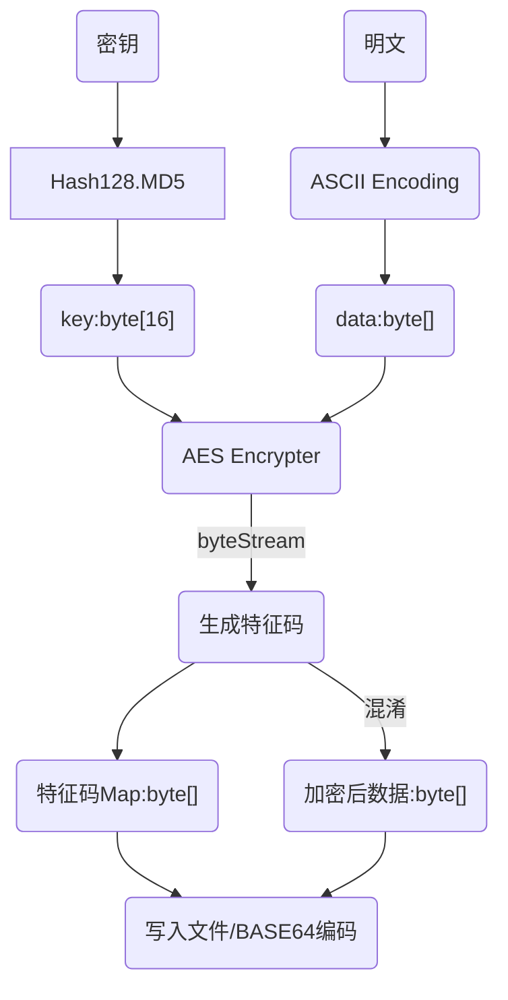

### 算法设计：一种基于MD5签名AES加密和特征码混淆的文本加密算法
# Project CryptCat

## 算法基本思路

```mermaid
graph TD;
data(明文)
key(密钥)
key-->Hash128.MD5-->keyData("key:byte[16]")-->AES
data-->encoder(ASCII Encoding)-->dataByte("data:byte[]")-->
AES(AES Encrypter)--byteStream-->
character(生成特征码)--混淆-->result("加密后数据:byte[]")
character-->result2("特征码Map:byte[]")-->com
result-->com("写入文件/BASE64编码")

```